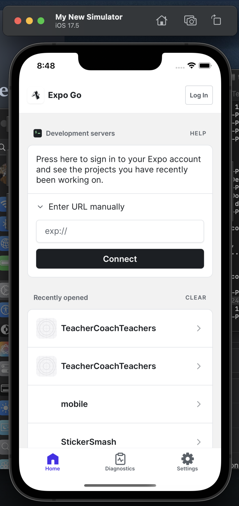

### **README: Running an Expo + Flask Backend with Docker for the First Time**

## **Introduction**

This project demonstrates how to run an **Expo React Native frontend** and a **Flask backend** together in a Dockerized environment. It uses:
- **Flask** for the backend.
- **PostgreSQL** as the database.
- **Expo** for the frontend, which supports React Native development for iOS, Android, and Web.

---

## **Prerequisites**

  Before running the project, ensure you have the following installed:

1. **Docker Desktop**:
     - Download and install from [https://www.docker.com/products/docker-desktop](https://www.docker.com/products/docker-desktop).
2. **Node.js and npm**:
     - Download and install from [https://nodejs.org/](https://nodejs.org/).
3. **Expo CLI** (optional for local testing):
```bash
npm install -g expo-cli
```

4. **Environment Variables**:
   - Copy the `.env.example` file to `.env` and update the values.
```bash
cp .env.example .env
```

### Notes on environment variables

  - The `.env` must remain in the repository root
  - LOG_LEVEL is the log level for our backend. 
  - FLASK_LOG_LEVEL is the log level for the Flask/Waitress web server
  - POSTGRES_USER, POSTGRES_PASSWORD can be any value for local development
  - POSTGRES_DB should remain as tct_database
  - SQLALCHEMY_DATABASE_URI should remain as is to reach the database over the docker network
  - COGNITO_USER_POOL_ID, COGNITO_CLIENT_ID, COGNITO_CLIENT_SECRET get from Trevor
  - FLASK_RUN_PORT only manages the backend port, not the frontend calls (will be solved later with a reverse proxy)
  - FLASK_RUN_HOST should remain as 0.0.0.0 to bind to all network interfaces for development
  - FLASK_ENV should remain as development for local development
---

## **Project Structure**

The project structure looks like this:

```
├── flask_app/                   # Flask backend module
│   ├── admin/                   # Admin panel HTML files and associated routes
│   │   ├── routes/              # Admin route handlers
│   │   └── templates/           # Admin HTML templates
│   ├── api/                     # API endpoints for the user application to use
│   │   └── auth/                # Authentication endpoints (mostly handled in frontend)
|   |   └── matching/            # Matching service/vector DB routes
|   |   └── mentors/             # Mentor specific routes (application submission, etc) (COULD BE CHANGED TO USER)
|   |   └── credits/             # Creation, redemption, and transfer endpoints
│   ├── extensions/              # Utility extensions (Cognito, database, logging, vector operations, etc)
│   ├── models/                  # Database models/migrations for SQLAlchemy
│   ├── app.py                   # Main Flask application factory. Registers blueprints from api/ and admin/
│   ├── config.py                # Configuration classes. Imports environment variables into Config classes
│   ├── Dockerfile               # Docker configuration for the flask container
│   └── run.py                   # Application entry point
├── mobile/                      # Expo frontend
│   ├── app/                     # Main application screens
│   │   └── (tabs)/             # Tab-based navigation screens
│   ├── assets/                  # Static assets (images, fonts)
│   ├── components/              # Reusable UI components
│   │   └── ui/                  # Basic UI elements
│   ├── hooks/                   # Custom React hooks
│   ├── scripts/                 # Utility scripts
│   ├── app.json                 # Expo configuration
│   └── package.json             # Frontend dependencies
├── docker-compose.yml           # Docker services configuration
└── README.md                    # Project documentation
```

---

## **Setup Instructions**

### **1. Build the Docker Images**
Use Docker Compose to build the project images:
```bash
docker compose build
```

---

### **2. Start the Containers**
Start the backend, database, and Expo frontend containers:
```bash
docker compose up
```

This will:
- Start the **Flask backend** on port `5001`.
- Start **PostgreSQL** without exposing a port (only accessible from the backend).
- Start the **Expo frontend** with Metro Bundler on `8081`.

---

### **3. Confirm Successful Startup**
After starting the containers, you should see output similar to this:
```bash
teachers-coach-teachers git:main
❯ docker compose up
[+] Running 4/4
 ✔ Network teachers-coach-teachers_default    Created                                                0.1s
 ✔ Container tct_postgres                     Created                                                0.1s
 ✔ Container expo-frontend                    Created                                                4.6s
 ✔ Container teachers-coach-teachers-backend  Created                                                0.1s
Attaching to expo-frontend, tct_postgres, teachers-coach-teachers-backend
tct_postgres                     |
tct_postgres                     | PostgreSQL Database directory appears to contain a database; Skipping initialization
tct_postgres                     |
tct_postgres                     | 2024-12-19 18:29:53.340 UTC [1] LOG:  starting PostgreSQL 15.10 (Debian 15.10-1.pgdg120+1) on x86_64-pc-linux-gnu, compiled by gcc (Debian 12.2.0-14) 12.2.0, 64-bit
tct_postgres                     | 2024-12-19 18:29:53.340 UTC [1] LOG:  listening on IPv4 address "0.0.0.0", port 5432
tct_postgres                     | 2024-12-19 18:29:53.340 UTC [1] LOG:  listening on IPv6 address "::", port 5432
tct_postgres                     | 2024-12-19 18:29:53.396 UTC [1] LOG:  listening on Unix socket "/var/run/postgresql/.s.PGSQL.5432"
tct_postgres                     | 2024-12-19 18:29:53.414 UTC [28] LOG:  database system was shut down at 2024-12-18 21:24:24 UTC
tct_postgres                     | 2024-12-19 18:29:53.427 UTC [1] LOG:  database system is ready to accept connections
teachers-coach-teachers-backend  |  * Serving Flask app 'app'
teachers-coach-teachers-backend  |  * Debug mode: on
teachers-coach-teachers-backend  | WARNING: This is a development server. Do not use it in a production deployment. Use a production WSGI server instead.
teachers-coach-teachers-backend  |  * Running on all addresses (0.0.0.0)
teachers-coach-teachers-backend  |  * Running on http://127.0.0.1:5001
teachers-coach-teachers-backend  |  * Running on http://172.18.0.4:5001
teachers-coach-teachers-backend  | Press CTRL+C to quit
teachers-coach-teachers-backend  |  * Restarting with stat
expo-frontend                    | Starting project at /app
teachers-coach-teachers-backend  |  * Debugger is active!
teachers-coach-teachers-backend  |  * Debugger PIN: 740-292-087
expo-frontend                    | Starting Metro Bundler
expo-frontend                    | The following packages should be updated for best compatibility with the installed expo version:
expo-frontend                    |   expo@52.0.9 - expected version: ~52.0.20
expo-frontend                    |   expo-font@13.0.1 - expected version: ~13.0.2
expo-frontend                    |   expo-router@4.0.7 - expected version: ~4.0.14
expo-frontend                    |   expo-splash-screen@0.29.12 - expected version: ~0.29.18
expo-frontend                    |   expo-system-ui@4.0.3 - expected version: ~4.0.6
expo-frontend                    |   react-native@0.76.2 - expected version: 0.76.5
expo-frontend                    |   react-native-webview@13.12.4 - expected version: 13.12.5
expo-frontend                    | Your project may not work correctly until you install the expected versions of the packages.
expo-frontend                    | Waiting on http://localhost:8081
expo-frontend                    | Logs for your project will appear below.
```

### Note:
To exit the compose containers and stop the services, press `Ctrl + C`.

To run the containers in the background, add the `-d` flag:
```bash
docker compose up --build -d
```

When running in detached (`-d`) mode, you can view the logs with:
```bash
docker compose logs -f
```
Or for a single service in the stack with
```bash
docker compose logs -f <service_name>
```

### **4. Flask database migrations and management**
To run database migrations, you can use the following commands:
```bash
# Initialize migrations (first time only)
docker compose run --rm -e FLASK_APP=manage.py backend flask db init

# Create new migration
docker compose run --rm -e FLASK_APP=manage.py backend flask db migrate -m "Description"

# Apply migration
docker compose run --rm -e FLASK_APP=manage.py backend flask db upgrade
```
This will initialize the migrations directory, create an initial migration, and apply the migration to the database.
A migration is necessary whenever the database models change.

*Note*: If you are not having success ensure you have imported the new models within the flask application.

#### _Alternatively_:
You can completely blow-out the database you have locally and start fresh with:
```bash
docker compose down -v --remove-orphans && \
docker volume rm flaskproject_postgres_data && \
docker compose up --build -d
```
**THIS WILL DELETE ALL DATA IN THE DATABASE**

## **Running the Application**

### **1. Frontend (Expo)**
The Expo app will start on port `8081`. Open the Metro Bundler interface in your browser:
```
http://localhost:8081
```

#### **Options: [HAVING TROUBLE WITH THIS RIGHT NOW DO NOT DO THIS]** 
- **Run on iOS Simulator:** Press `i` in the terminal or click the option in Metro Bundler.
- **Run on Android Emulator:** Press `a` in the terminal or click the option in Metro Bundler.
- **Scan QR Code:** Open the **Expo Go** app on your mobile device and scan the QR code from Metro Bundler.


#### **FIRST TIME EXPO**
### **Using the Simulator for the First Time with Expo**

If this is your first time using Expo with a simulator, follow this guide to set up and run the app on an iOS simulator or Android emulator.

---

## **1. Prerequisites for Simulators**

### **iOS Simulator (Mac Only)**
1. **Install Xcode**:
   - Open the Mac App Store and download **Xcode**.
   - After installation, open Xcode and agree to the license terms.
2. **Install Xcode Command Line Tools**:
   ```bash
   xcode-select --install
   ```
3. **Verify Simulator Availability**:
   - Open Xcode > Preferences > Components.
   - Download any additional simulators (e.g., iOS 16.4).

---

### **Android Emulator**
1. **Install Android Studio**:
   - Download and install **Android Studio** from [https://developer.android.com/studio](https://developer.android.com/studio).
   - During installation, select the option to install the Android Virtual Device (AVD) Manager.
2. **Set Up an Android Emulator**:
   - Open **Android Studio**.
   - Go to **Tools > AVD Manager** and click **Create Virtual Device**.
   - Select a device (e.g., Pixel 4) and a system image (e.g., Android 13).
   - Finish setup and start the emulator.
3. **Verify Emulator Setup**:
   - Start the emulator and ensure it runs smoothly.

---

## **2. Running the Expo App on a Simulator**

### **Step 1: Start the Expo Project**
Ensure the Expo project is running:
```bash
docker compose up expo-frontend
```

**Simple Solution is to, alternatively, if running locally:**
```bash
cd mobile
npx expo start
```

Open the Metro Bundler interface in your browser or expo using following links through docker:
```
http://localhost:8081
exp://localhost:8081
```

---

### **Step 2: Open on iOS Simulator**
1. Ensure the iOS simulator is running. Open it manually via Xcode:
   - Xcode > Open Developer Tools > Simulator.
2. In the terminal running Expo, press:
   ```plaintext
   i
   ```
   - Expo CLI will automatically build and launch the app in the iOS simulator.

---

### **Step 3: Open on Android Emulator**
1. Start the Android emulator from Android Studio:
   - Open Android Studio > Tools > AVD Manager > Start Emulator.
2. In the terminal running Expo, press:
   ```plaintext
   a
   ```
   - Expo CLI will install the app and launch it in the Android emulator.

---

## **3. Troubleshooting Simulator Issues**

### **iOS Simulator Issues**
- **Simulator Not Opening Automatically**:
  - Open the simulator manually via Xcode:
    ```plaintext
    Xcode > Open Developer Tools > Simulator
    ```
  - Then press `i` in the terminal.
- **No Device Found**:
  - Ensure Xcode command-line tools are installed:
    ```bash
    xcode-select --install
    ```

---

### **Android Emulator Issues**
- **"No Connected Devices"**:
  - Verify that the emulator is running:
    ```bash
    adb devices
    ```
  - If no devices are listed, restart the emulator via Android Studio.
- **Expo CLI Can't Find Emulator**:
  - Ensure the `ANDROID_HOME` environment variable is set:
    ```bash
    export ANDROID_HOME=~/Library/Android/sdk
    export PATH=$PATH:$ANDROID_HOME/emulator:$ANDROID_HOME/tools:$ANDROID_HOME/tools/bin:$ANDROID_HOME/platform-tools
    ```
    Add these lines to your shell config (e.g., `.bashrc`, `.zshrc`).

---

### **4. Testing the App on the Simulator**
Once the app launches on the simulator:
- **Verify Backend Connectivity**:
  - The app should call the `/check-database` endpoint and display the response.
- **Reload the App**:
  - Press `cmd + d` (iOS) or `cmd + m` (Android) to open the developer menu.
  - Select **Reload**.

---


### **2. Backend (Flask)**
The Flask backend will start on port `5000`. Test the backend by accessing the `/health` endpoint:
```
http://localhost:5000/health
```

---


## **Accessing the Application**

### **Expo Frontend**
- **Web:** Visit `http://localhost:8081`.
- **Mobile Devices:** Use the Expo Go app and enter URL `exp://localhost:8081`.

### **Flask Backend**
Access the Flask backend via:
- Example endpoint: `http://localhost:5001/check-database`

---

## **Testing Backend Connection**

To verify the backend and frontend connection, follow these steps:

1. Start the app on a simulator or physical device.
2. The frontend should call the `/check-database` endpoint to verify backend connectivity.
3. The database status (e.g., "Database exists and is accessible") will display in the app.

---

## **Common Issues and Debugging**

### **1. Backend Not Accessible**
- Ensure the backend container is running:
  ```bash
  docker ps
  ```
- Check the logs for errors:
  ```bash
  docker logs flask-app
  ```

### **2. Expo Frontend Not Working**
- If the QR code doesn’t show, ensure Expo is started in tunnel mode:
  ```bash
  npx expo start --tunnel
  ```

---
